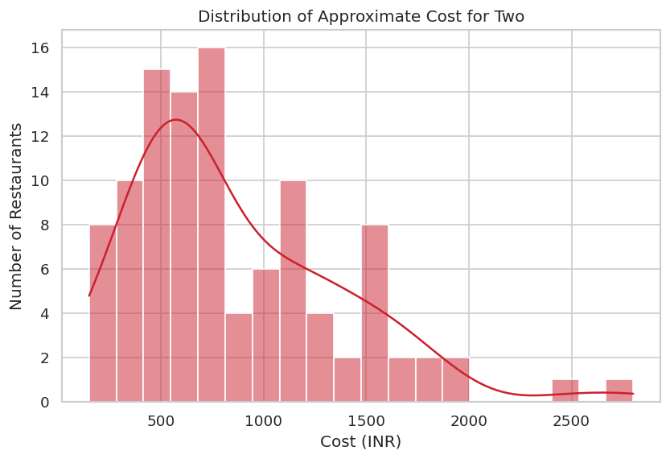
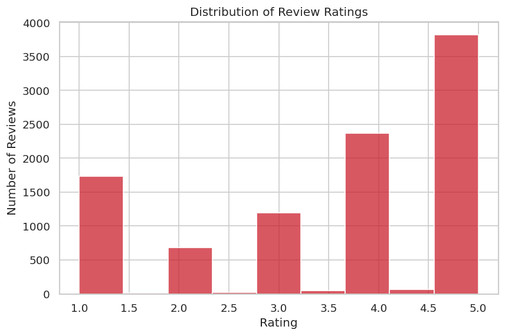
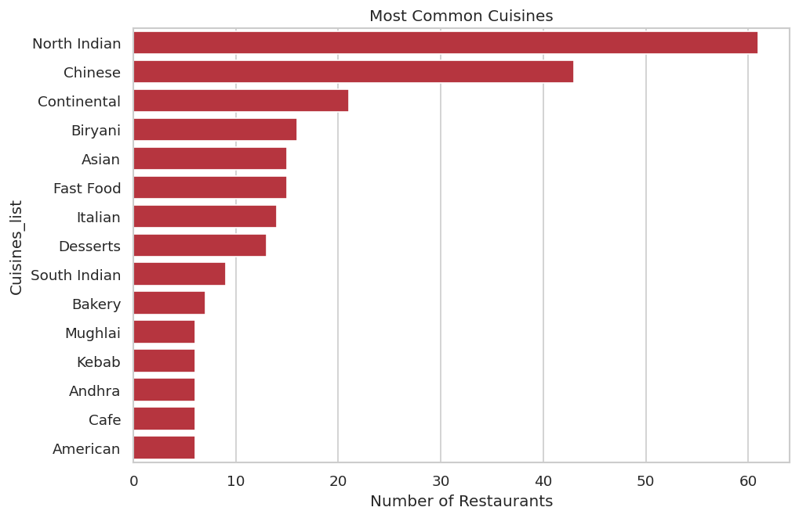
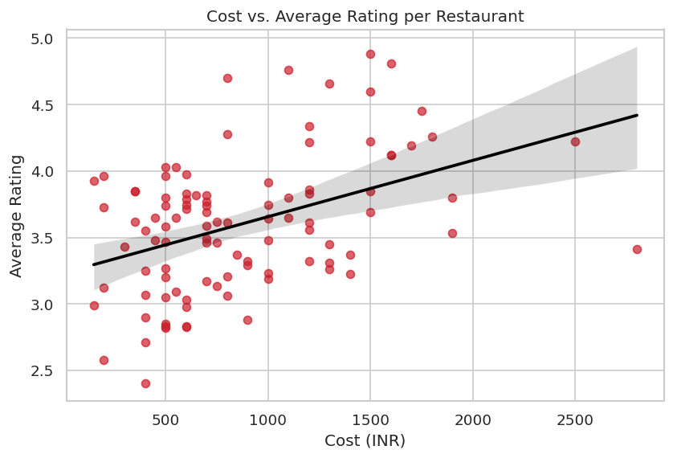
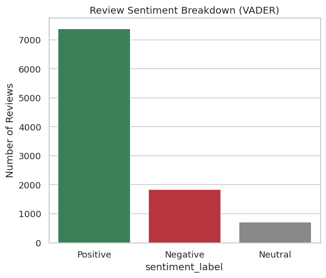
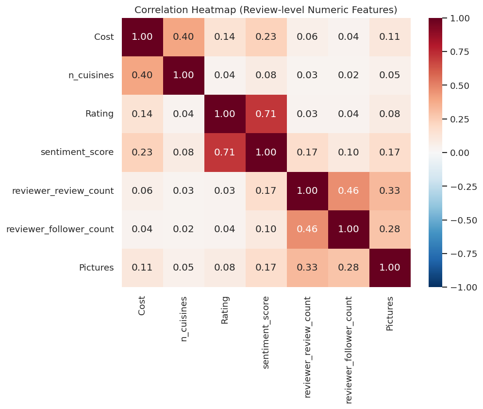
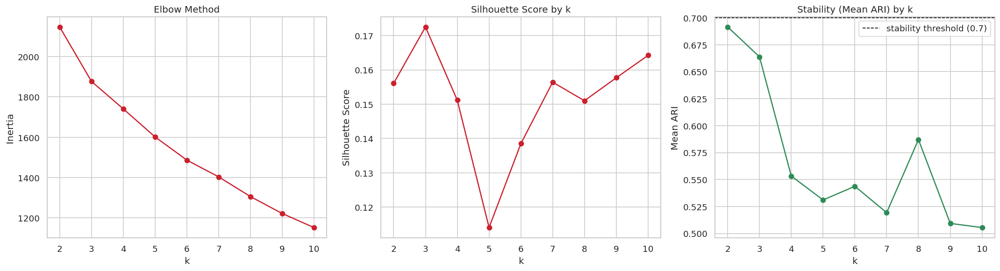
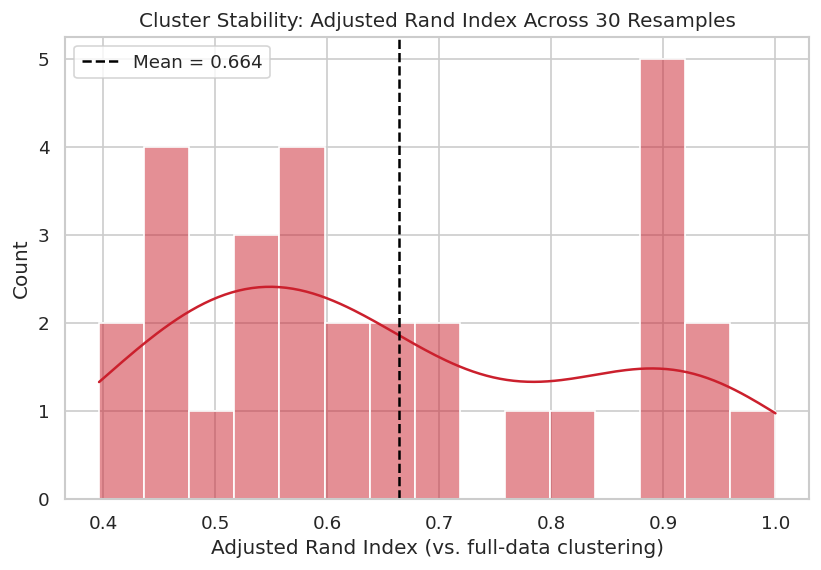

# 🍽️ Zomato Restaurant Clustering & Sentiment Analysis

**[📓 Open Notebook in Colab](https://colab.research.google.com/github/sandeep-sankhla20/Zomato-Restaurant-Clustering/blob/main/Sample_ML_Submission_Template.ipynb)**

An unsupervised machine learning project that clusters ~100 Hyderabad restaurants into
data-driven segments and analyzes sentiment across ~10,000 customer reviews — combining
structured metadata (cost, cuisine) with NLP-derived signal from raw review text.

---

## 📋 Business Problem

Zomato's restaurant and review data holds valuable, largely unstructured information about
pricing, cuisine, and — most importantly — what customers actually think of a restaurant. This
project analyzes that data to:

1. **Quantify customer sentiment** from raw review text.
2. **Cluster restaurants into meaningful segments** based on cost, cuisine, rating, popularity,
   and sentiment — so customers can more easily find the right restaurant, and Zomato /
   restaurant owners can see where a restaurant stands competitively.

---

## 🔬 Approach

| Step | What happens |
|---|---|
| **1. Data cleaning & feature engineering** | Parse malformed cost/rating/metadata fields, multi-label encode cuisines, aggregate review-level signal up to restaurant level |
| **2. NLP pipeline** | Contraction expansion → cleaning → tokenization → POS-aware lemmatization → TF-IDF + SVD text embeddings |
| **3. Sentiment analysis** | VADER lexicon-based scoring of every review |
| **4. Hypothesis testing** | Pearson correlation, Welch's t-test, one-way ANOVA — formally validating EDA patterns instead of relying on charts alone |
| **5. Clustering** | K-Means, Agglomerative (Hierarchical), and DBSCAN — each independently hyperparameter-tuned |
| **6. Explainability** | A surrogate decision tree + SHAP values to identify what actually drives cluster assignment |

---

## 📊 Exploratory Data Analysis

**Cost distribution** — most restaurants sit in a budget-to-mid-range bracket, with a long tail of
pricier venues:



**Rating distribution** — ratings skew positive, typical of review platforms where satisfied
customers are more likely to leave a review at all:



**Most common cuisines** — North Indian and Chinese dominate the catalog:



**Cost vs. average rating** — only a weak-to-moderate relationship; "expensive = better" doesn't
hold strongly in this data:



**Review sentiment breakdown** (VADER) — the majority of reviews score positive, consistent with,
but not identical to, the star-rating skew above:



**Correlation heatmap** — confirms the numeric feature set isn't dominated by redundant signals
before it's fed into clustering:



---

## ⭐ Key Finding: Fixing an Unstable Clustering

The initial K-Means model was tuned by maximizing **Silhouette score alone**, which selected
`k=10`:



A resampling-based stability check (Adjusted Rand Index across 30 subsamples) revealed this
`k=10` model was **highly unstable** — a mean ARI of just 0.003, effectively random cluster
assignment on any new sample:



Re-selecting `k` using **both** Silhouette score *and* stability together instead chose `k=3`,
which is dramatically more stable (mean ARI 0.664) at essentially the same Silhouette score. This
confirmed the instability was an artifact of over-segmenting a small (~100 restaurant) dataset into
too many clusters — not a fundamental property of the data. **This is the central technical
finding of the project**: a model can look fine on a single metric and still fail a basic
reliability check.

---

## 🧩 What the Segments Actually Mean

| Segment | Restaurants | Avg. Cost | Avg. Rating | Avg. Sentiment |
|---|---|---|---|---|
| Premium & High-Rated | 29 | ₹1,348 | 3.99 | 0.69 |
| Budget & Lower-Sentiment | 42 | ₹611 | 3.31 | 0.31 |
| Budget-Mid & Mixed | 14 | ₹504 | 3.62 | 0.49 |

SHAP analysis shows these segments are driven primarily by **review-text content and cuisine
identity**, not directly by cost or rating — yet they still line up with an interpretable
price/quality gradient, which is what makes them business-usable.

**What this means in practice:**
- **For Zomato:** the Budget & Lower-Sentiment segment (largest, 42 restaurants, lowest rating) is
  the highest-ROI target for a focused quality-improvement outreach.
- **For restaurant owners:** landing in that segment signals a service/consistency issue, not a
  pricing one — the sentiment gap is driven more by review tone than cost.
- **For diners:** "top-rated / occasion dining" → Premium segment; "best value nearby" →
  Budget-Mid segment.

---

## 📁 Repository Structure

```
├── Sample_ML_Submission_Template.ipynb        <- full analysis notebook, run top to bottom
├── Zomato Restaurant names and Metadata.csv   <- restaurant-level data
├── Zomato Restaurant reviews.csv              <- ~10,000 customer reviews
├── images/                                     <- charts used in this README (extracted from the notebook)
├── requirements.txt
├── .gitignore
└── README.md
```

---

## ▶️ How to Run

1. Open `Sample_ML_Submission_Template.ipynb` in Google Colab (badge link at the top).
2. When prompted by the dataset-loading cell, upload both CSVs (or place them in the same
   directory as the notebook).
3. Run all cells top to bottom. Expect ~5–10 minutes total — NLTK downloads and the DBSCAN grid
   search are the slowest steps.

To run locally instead of Colab:
```bash
pip install -r requirements.txt
jupyter notebook Sample_ML_Submission_Template.ipynb
```

---

## 🛠️ Tech Stack

`pandas` · `NumPy` · `scikit-learn` · `SciPy` · `NLTK` · `contractions` · `VADER Sentiment` ·
`SHAP` · `Plotly` · `Matplotlib` · `Seaborn`

---

## ⚠️ Limitations

- Small (~100 restaurant), single-city (Hyderabad) dataset — cluster boundaries shouldn't be
  reused as-is for another city.
- Sentiment is scored with a general-purpose lexicon (VADER), not one trained specifically on
  restaurant reviews.
- Clustering stability is **moderate, not high** (ARI 0.664) — broad segment-level patterns are
  trustworthy, but any single restaurant near a segment boundary should be treated as provisional.

Full details are in the notebook's Limitations & Assumptions section.

---

## 📄 License

This project is for educational/portfolio purposes, built on publicly available Zomato listing
and review data.
